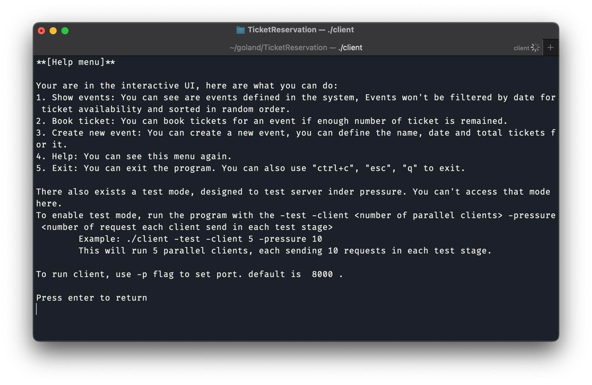
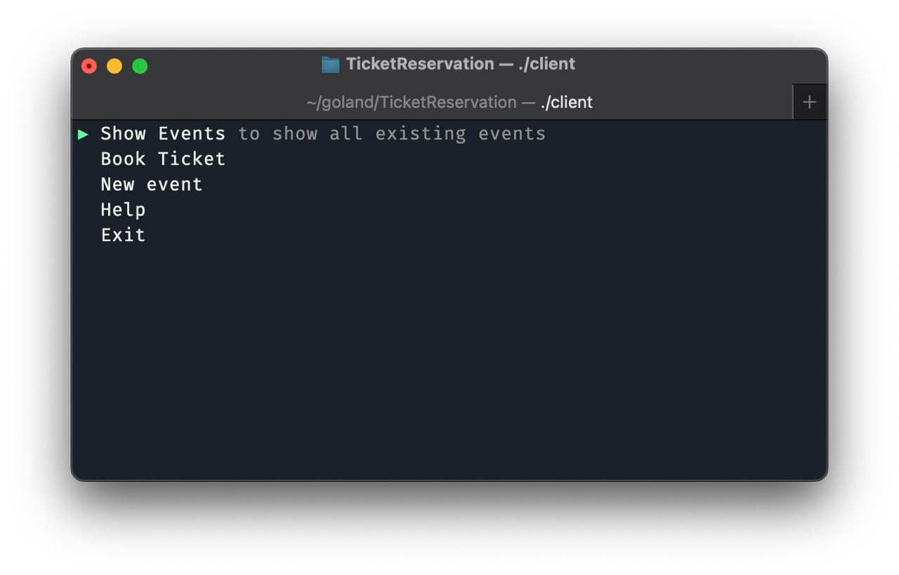
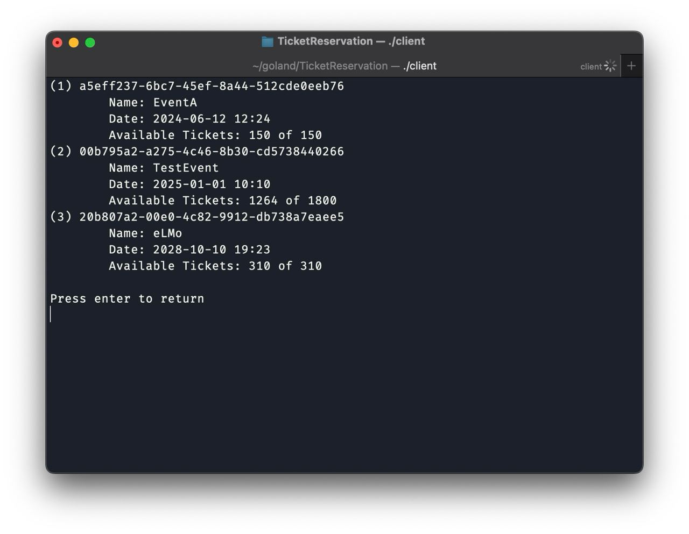
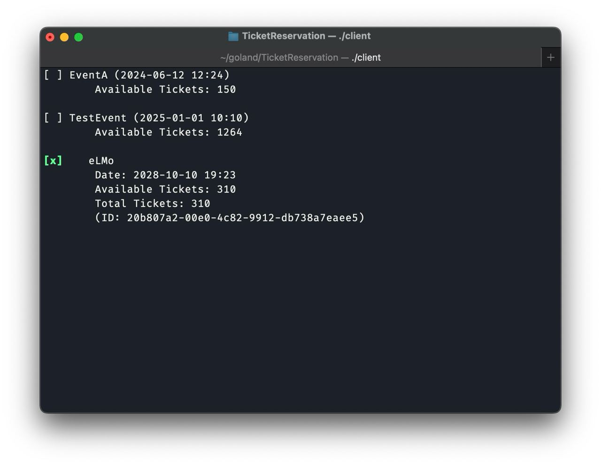
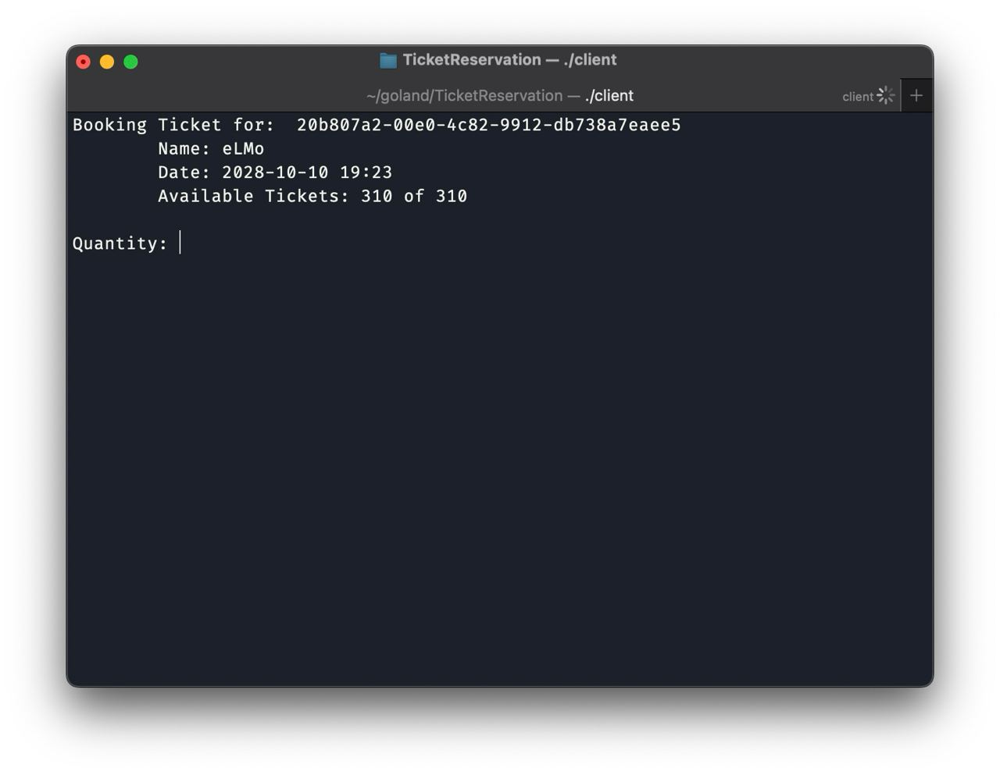
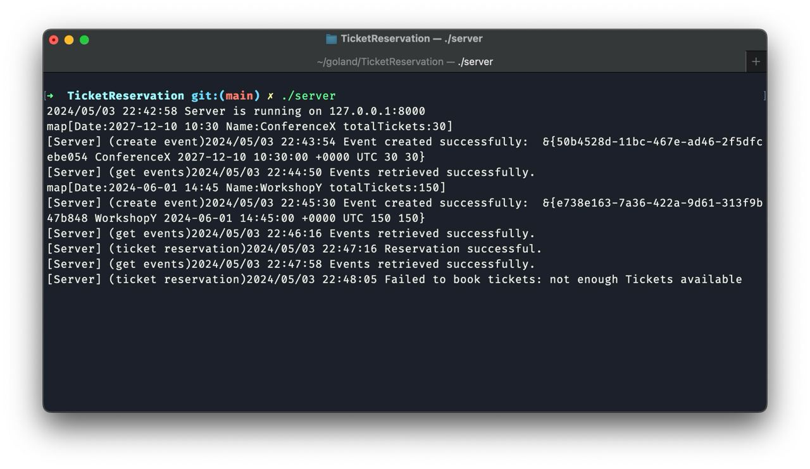

# Concurrent Ticket Reservation System

The Concurrent Ticket Reservation System is a server-client model for ticket reservation developed in Go. The server is capable of managing multiple client requests concurrently, ensuring concurrency control over both server and client connections. Additionally, a caching system has been incorporated to optimize the handling of regularly recurring requests.

---
# Installation

To run this project, you need to have Go installed on your system. You can download and install it from the official Go website.
Desired go version for this project is `1.21`.

## install dependencies 

Navigate to the root directory of the project where the go.mod file is located, and compile the dependencies by executing the following command:

```
make deps
```

This command will download and install all the necessary dependencies for the project.

## generate binaries

To generate server and client binary files, just use:

```
make build
```

## running projects

You can simply run project by using `./client` or `./server`. Tpu can also set some options through **Commandline arguments** 
that are explained in client's help menu.



---
# Key Features

## concurrency control
In this project, we've applied concurrency control measures using mutexes to avoid race conditions and maintain data integrity. 
We've used mutexes to safeguard shared resources .

The `sync.Map` enables safe access for multiple Goroutines, while the `sync.RWMutex` allows either multiple readers or 
a single writer to access shared resources like event details. This approach guarantees that concurrent interactions 
with the ticket reservation system are reliable and consistent.

## client interface
The client interface in the ticket reservation system provides a user-friendly way for clients to interact with the system. 
It likely includes features such as displaying available events, allowing users to reserve ticket. 
The interface enhances the usability of the system by simplifying the process of browsing events and managing ticket reservations, 
ultimately improving the overall user experience. Also, client UI is able to enhance used experiments and make it easier to work with.






## logging

Enhanced logging mechanism enable us to track program flow and detect potential bugs, making program more explainable and easier to debug.



## fairness 
Go's scheduler ensures fair scheduling of Goroutines, preventing any single Goroutine from monopolizing CPU resources. 
It employs techniques like work stealing to balance workload across CPU cores, preemptive scheduling to prevent blocking, 
round-robin local run queues for fair Goroutine selection, cooperative yielding with `runtime.Gosched`, 
priority-based scheduling, a network poller for efficient I/O, and fair mutexes to prevent starvation.


## resource managment

In Go, Goroutines  managing  typically doesn't require much effort. 
However, in scenarios where the number of concurrent Goroutines needs to be controlled to prevent resource exhaustion, 
strategies like using buffered channels, semaphores, or worker pools can be employed. 
Packages like `netutil` offer utilities for managing Goroutine concurrency.


## caching

We can implement a caching mechanism, we can use `sync.Map` or a `map + Mutex for each item`. We used `sync.Map` option and continue our explanation for this candidate.
`sync.Map` is a high-performance, thread-safe map that provides built-in synchronization to prevent race conditions 
without the need for explicit locks or mutexes. It's designed to address the limitations of standard Go maps in concurrent scenarios.

Being inherently a map, `sync.Map` can be used to store key-value pairs, but in a way that allows for efficient and concurrent access.
But how it can be used to implement a caching mechanism?
- **Concurrent access**: Multiple goroutines can access the cache simultaneously, and sync.Map ensures that the operations are thread-safe and free from race conditions.
- **Lazy initialization**: sync.Map allows for lazy initialization of map entries, which means that you can initialize the cache lazily, rather than initializing the entire map before use.
- **Non-blocking operations**: sync.Map provides non-blocking operations such as *Load*, *Store*, and *Delete*, which can be beneficial in scenarios where avoiding blocking and contention is crucial for performance.
- **Efficient reads and infrequent writes**: sync.Map is optimized for scenarios where there are frequent reads and infrequent writes, which is common in caching scenarios.

In a caching mechanism, it can be used to store cached values, and multiple goroutines can access the cache concurrently. 
When a goroutine needs to access a cached value, it can use the *Load* method to retrieve the value from the cache. 
If the value is not found, the goroutine can use the *Store* method to store the value in the cache. 
The *Delete* method can be used to remove cached values that are no longer needed.

Overall, `sync.Map` provides a convenient and efficient way to implement a caching mechanism in Go, 
allowing for concurrent access, lazy initialization, and non-blocking operations.

**Example of a cache with sync.Map**
```go
type Cache struct {
    store sync.Map
}

func (c *Cache) Set(key string, value string) {
    c.store.Store(key, value)
}

func (c *Cache) Get(key string) (string, bool) {
    value, ok := c.store.Load(key)
    if ok {
        return value.(string), ok
    }
    return "", ok
}

func (c *Cache) Delete(key string) {
    c.store.Delete(key)
}
```

---
